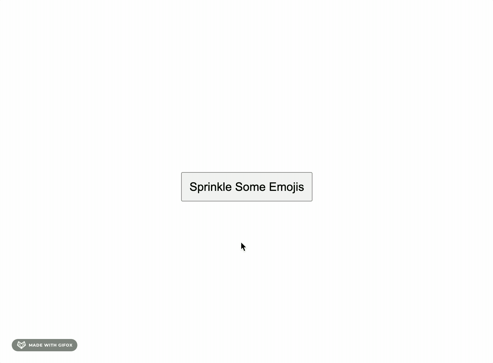

# emoji-sprinkle


[](https://github.com/JesseKuntz/emoji-sprinkle/graphs/commit-activity)

I wanted to be able to sprinkle emojis across a web page and then let them fade out "randomly" so I made this package so that everyone can have that simple joy.



## Usage

```js
import { sprinkleEmojis } from 'emoji-sprinkle';

...

sprinkleEmojis();
```

## Options

<table>
  <thead>
    <tr>
      <th>
        Option
      </th>
      <th>
        Description
      </th>
      <th>
        Type
      </th>
      <th>
        Default
      </th>
    </tr>
  </thead>
  <tbody>
    <tr>
      <td>
        <code>emoji</code>
      </td>
      <td>
        The desired emoji!
      </td>
      <td>
        <code>string</code>
      </td>
      <td>
        🐢
      </td>
    </tr>
    <tr>
      <td>
        <code>count</code>
      </td>
      <td>
        The number of emojis that will be sprinkled across the screen.
      </td>
      <td>
        <code>number</code>
      </td>
      <td>
        100
      </td>
    </tr>
    <tr>
      <td>
        <code>fade</code>
      </td>
      <td>
        The max amount of seconds that any one emoji will take to fade from the screen.
      </td>
      <td>
        <code>number</code>
      </td>
      <td>
        2
      </td>
    </tr>
    <tr>
      <td>
        <code>fontSize</code>
      </td>
      <td>
        The <code>font-size</code> of the emoji.
      </td>
      <td>
        <code>number</code>
      </td>
      <td>
        42
      </td>
    </tr>
  </tbody>
</table>

Example using custom options:
```javascript
sprinkleEmojis({ emoji: '🎉', count: 50, fade: 10, fontSize: 10 });
```

## Additional Customization

If more control over styling is needed, the following classes pertain to each element:
- `emoji-sprinkle-container`: the container holding all of the emojis, which is removed after the max fade duration is met
- `emoji-sprinkle`: each individual emoji
